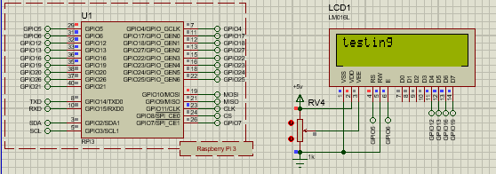
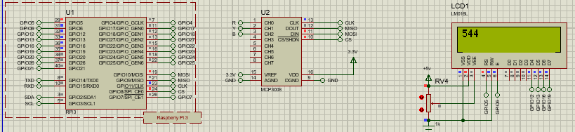

.. note::
   This is Test Docs, Complete docs will be released soon!

Import LCD
^^^^^^^^^^

.. code-block:: python
   :caption: main.py
   :linenos:

   from display.lcd import LCD

   lcd = LCD(5, 6, 12, 13, 16, 19)
   or
   lcd = LCD(rs=5, en=6, d4=12, d5=13, d6=16, d7=19)

   lcd.cursor_start(0, 0)
   lcd.print_line(f"testing")  # "Message string

Import MCP3008
^^^^^^^^^^^^^^

.. code-block:: python
   :caption: main.py
   :linenos:

   from analogue.mcp3008 import MCP3008

   adc_mcp3008 = MCP3008(max_speed_hz=1_000_000)

   lcd.cursor_start(0, 0)
   lcd.print_line(adc_mcp3008)  # "Message string

